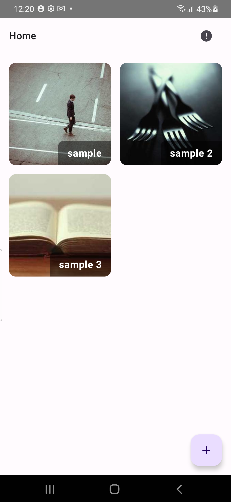
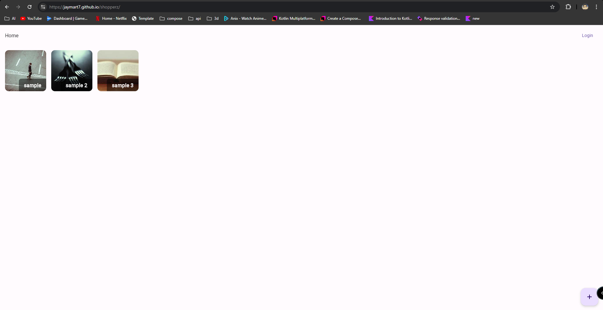
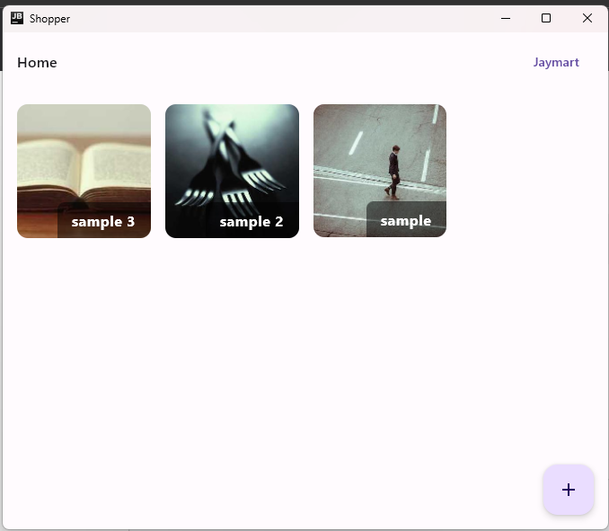

This is a Kotlin Multiplatform project targeting Android, iOS, Web, Desktop

`Live` : https://jaymart7.github.io/shopper/

`Server` : https://github.com/jaymart7/ShopperServer

Local

* `jsBrowserRun`
* `desktopApp:run`

Mobile
-

Web
-

Desktop
-
